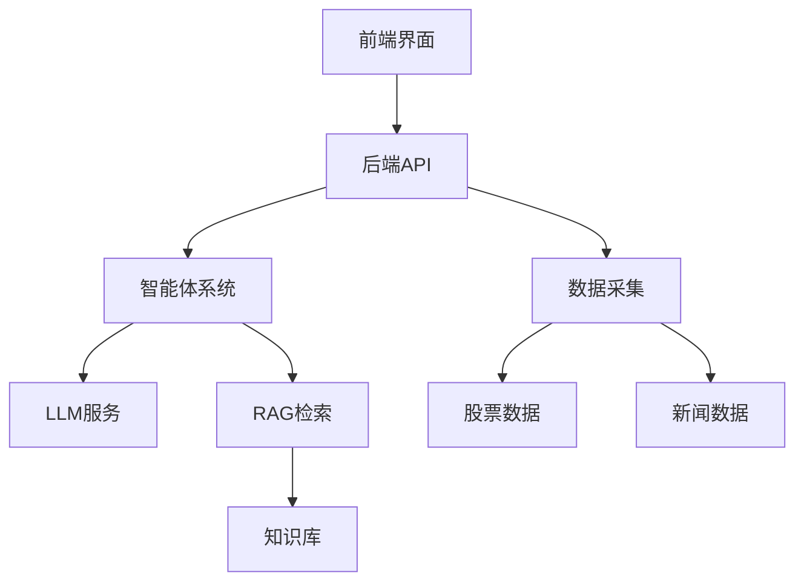

# 财闻智析 (CWZX) - 完整项目文档

## 📋 目录
1. [项目概述](#项目概述)
2. [快速启动](#快速启动)
3. [技术架构](#技术架构)
4. [功能特性](#功能特性)
5. [安装配置](#安装配置)
6. [API文档](#api文档)
7. [开发指南](#开发指南)
8. [问题解答](#问题解答)
9. [创业计划](#创业计划)

---

## 📖 项目概述

财闻智析是一个智能金融决策平台，整合了实时股票数据、新闻分析、AI助手等功能，为投资者提供全方位的金融信息服务。

### 核心价值
- 解决投资者信息过载问题
- 提供客观、可信的金融信息分析
- 基于AI的智能投资决策支持
- 实时消息面数据分析

### 技术优势
- **多智能体协作系统**：基于 LangChain 的多模型协作
- **RAG检索增强生成**：结合向量检索和语义搜索
- **深度优化的LLM**：专门针对金融领域优化
- **多数据源整合**：腾讯、新浪、网易、东方财富等

---

## 🚀 快速启动

### 环境要求
- Python 3.8+
- 智谱AI API密钥
- 网络连接

### 一键启动
```bash
# 推荐使用主启动脚本
python final_start.py
```

### 手动启动（备用方案）
```bash
# 终端1 - 启动后端
cd backend
python main.py

# 终端2 - 启动前端
cd 前端-main/UI
python -m http.server 8080
```

### 访问地址
- **前端界面**: http://localhost:8080 或 http://localhost:8081
- **后端API**: http://localhost:8000
- **API文档**: http://localhost:8000/docs

---

## 🛠 技术架构

### 整体架构


### 技术栈

#### 后端技术
- **框架**: FastAPI, Flask, Uvicorn
- **AI服务**: 智谱AI GLM-4.5, LangChain
- **数据处理**: Pandas, NumPy
- **数据库**: SQLite, SQLAlchemy
- **RAG技术**: jieba, scikit-learn

#### 前端技术
- **核心**: HTML/CSS/JavaScript
- **UI组件**: Bootstrap
- **图表**: Chart.js, ECharts, Plotly
- **通信**: Fetch API

#### 数据源
- **股票数据**: 腾讯财经、新浪财经、网易财经、东方财富
- **新闻数据**: 多源新闻聚合
- **财务数据**: 上市公司财报、行业数据

### 项目结构
```
CWZX-main/
├── backend/                # 后端服务
│   ├── api/               # API路由
│   ├── models/            # 数据模型
│   ├── services/          # 业务逻辑
│   └── utils/             # 工具模块
├── 前端-main/UI/          # 前端界面
├── agents&rag/            # RAG服务
├── services/              # 核心服务
├── utils/                 # 通用工具
├── data_collection/       # 数据收集
├── 爬虫/                  # 网络爬虫
├── RAG_datasets/          # 数据集
└── 金融数据/              # 金融数据
```

---

## 💡 功能特性

### 1. 实时股票数据
- **多数据源自动切换**：腾讯、新浪、网易、东方财富API
- **真实数据**：实时股价、涨跌幅、成交量
- **智能缓存**：10秒缓存避免频繁请求
- **涨跌分布**：智能估算市场情绪

### 2. AI助手功能
- **智能对话**：基于智谱AI GLM-4.5
- **金融专业**：专注于投资、理财、股市分析
- **上下文理解**：支持多轮对话
- **个性化服务**：根据用户需求定制回答

### 3. 新闻分析
- **实时新闻**：自动抓取财经新闻
- **情感分析**：分析新闻对股市的影响
- **可信度评估**：判断信息真实性
- **影响评估**：评估对特定股票的利好/利空

### 4. RAG检索功能
- **知识库检索**：基于TF-IDF的向量检索
- **智能问答**：结合知识库和LLM生成答案
- **文档理解**：支持多种格式文档分析

### 5. 悬浮聊天
- **悬浮按钮**：右下角可拖动聊天按钮
- **即时对话**：任何页面随时开始聊天
- **历史记录**：自动保存聊天历史
- **状态显示**：实时连接状态

---

## ⚙️ 安装配置

### 1. 环境配置

#### 创建虚拟环境
```bash
python -m venv cwzx
# Windows
cwzx\Scripts\activate
# Linux/Mac
source cwzx/bin/activate
```

#### 安装依赖
```bash
pip install -r requirements.txt -i https://pypi.tuna.tsinghua.edu.cn/simple/
```

### 2. 智谱AI配置

#### 获取API密钥
1. 访问 [智谱AI开放平台](https://open.bigmodel.cn/)
2. 注册账号并获取API密钥

#### 配置环境变量
创建 `.env` 文件：
```bash
# 智谱AI配置
ZHIPUAI_API_KEY=your_api_key_here

# 日志级别
LOG_LEVEL=INFO

# 缓存设置
CACHE_DURATION=10
```

### 3. 数据库初始化
```bash
cd backend
python -c "from services.database import init_db; import asyncio; asyncio.run(init_db())"
```

---

## 📚 API文档

### 股票数据API

#### 获取股票信息
```http
GET /api/v1/stocks/{code}
```

**示例**:
```bash
curl http://localhost:8000/api/v1/stocks/600519
```

#### 市场概览
```http
GET /api/v1/stocks/market/overview
```

#### 涨跌分布
```http
GET /api/v1/stocks/distribution
```

### AI对话API

#### 发送消息
```http
POST /api/v1/chat/message
Content-Type: application/json

{
    "message": "什么是市盈率？",
    "session_id": "user_123"
}
```

### 智谱AI SDK示例

#### 基础调用
```python
from zai import ZhipuAiClient

client = ZhipuAiClient(api_key="your-api-key")

response = client.chat.completions.create(
    model="glm-4.5",
    messages=[
        {"role": "user", "content": "分析一下当前市场趋势"}
    ],
    thinking={"type": "enabled"},
    max_tokens=4096,
    temperature=0.6
)

print(response.choices[0].message)
```

#### 流式调用
```python
response = client.chat.completions.create(
    model="glm-4.5",
    messages=[
        {"role": "user", "content": "请详细分析贵州茅台的投资价值"}
    ],
    stream=True,
    max_tokens=4096
)

for chunk in response:
    if chunk.choices[0].delta.content:
        print(chunk.choices[0].delta.content, end='', flush=True)
```

---

## 🔧 开发指南

### 添加新的数据源
1. 在 `RealStockDataService` 类中添加新的API方法
2. 将方法加入 `api_sources` 列表
3. 实现数据解析逻辑

### 扩展AI功能
1. 修改 `chat_service.py`
2. 添加新的处理逻辑
3. 更新RAG知识库

### 运行测试
```bash
# 测试股票服务
python test_real_stock_service.py

# 测试涨跌分布
python test_distribution.py

# 测试完整功能
python test_complete.py
```

### 日志配置
- 日志文件位置：`logs/cwzx_YYYYMMDD.log`
- 支持日志轮转，单个文件最大10MB
- 控制台和文件双重输出

---

## ❓ 问题解答

### 常见问题

#### Q: 如何解决后端启动失败？
**A**: 
1. 检查端口8000是否被占用：`netstat -ano | findstr :8000`
2. 确认依赖已正确安装：`pip install -r requirements.txt`
3. 检查智谱AI API密钥是否正确配置

#### Q: 前端显示"测试中..."不更新怎么办？
**A**: 
1. 确认后端服务正在运行
2. 检查浏览器开发者工具的Network选项卡
3. 尝试强制刷新页面（Ctrl+F5）

#### Q: AI助手回复"抱歉，我暂时无法理解您的问题"？
**A**: 
1. 检查ZHIPUAI_API_KEY环境变量是否设置
2. 确认网络连接正常
3. 查看后端日志中的错误信息

#### Q: 如何获取真实股票数据？
**A**: 系统已集成多个数据源API：
- 腾讯财经API（推荐）
- 东方财富API
- 新浪财经API
- 网易财经API

#### Q: 系统支持哪些股票代码？
**A**: 
- 上海交易所：6xxxxx（如：600519 贵州茅台）
- 深圳主板：0xxxxx（如：000001 平安银行）
- 创业板：3xxxxx（如：300750 宁德时代）

### 故障排除

#### 端口占用问题
```bash
# Windows
netstat -ano | findstr :8000
taskkill /F /PID <进程ID>

# Linux/Mac
lsof -i :8000
kill -9 <进程ID>
```

#### 依赖问题
```bash
pip install flask flask-cors requests
pip install fastapi uvicorn pydantic
pip install zhipuai langchain
```

#### 浏览器缓存问题
- 按 Ctrl+F5 强制刷新
- 使用无痕模式访问
- 清除浏览器缓存

---

## 💼 创业计划

### 项目背景
在信息爆炸的时代，投资者每天被海量的新闻、资讯和财务报表所淹没，难以及时、准确地解读这些信息对特定股票或基金的影响。现有投资平台主要关注技术面和基本面数据，对消息面数据利用不足。

### 市场机会
- 全球金融科技市场预计2025年达到3050亿美元
- 超过50%投资者依赖即时新闻做投资决策
- 现有平台缺乏智能化信息分析工具

### 核心优势
1. **技术创新**：融合LLM、RAG和多智能体技术
2. **数据优势**：多源数据整合，提升可信度
3. **用户体验**：简洁友好界面，个性化定制
4. **商业模式**：订阅服务+数据增值+企业定制

### 目标市场
- **主要市场**：个人投资者（专业人士、爱好者、零基础用户）
- **次要市场**：中小型投资机构
- **长期目标**：散户市场20%-25%份额

### 盈利模式
1. **订阅服务**：基础版、高级版、专业版
2. **API接口**：为金融机构提供技术服务
3. **定制解决方案**：企业级客户定制开发
4. **数据报告**：深度分析报告和市场洞察

### 资金需求
- **启动资金**：50万元人民币
- **资金用途**：
  - 技术开发：40%
  - 市场推广：20%
  - 团队建设：20%
  - 日常运营：14%
  - 法律合规：6%

### 财务预测（3年）
- **第一年**：净亏损50万元（投入期）
- **第二年**：净亏损5万元（成长期）
- **第三年**：净利润5万元（盈利期）

### 风险控制
1. **市场风险**：差异化定位，专注细分市场
2. **技术风险**：持续优化，加强可解释性
3. **政策风险**：严格合规，数据安全保护
4. **财务风险**：多元化融资，成本控制

---

## 📞 联系我们

- **项目主页**：[GitHub Repository]
- **问题反馈**：[Issues]
- **技术支持**：[contact@cwzx.com]

---

## 📄 许可证

本项目采用 MIT 许可证 - 查看 [LICENSE](LICENSE) 文件了解详情

---

**© 2025 财闻智析团队**

*最后更新：2025-08-26*